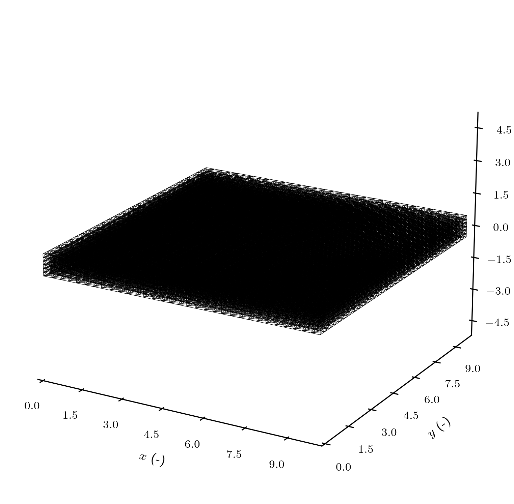
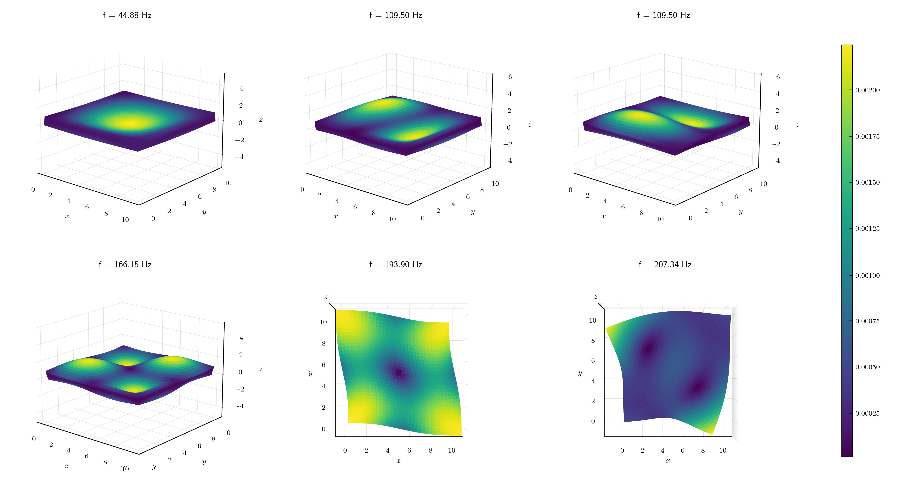

# LSA-FW Elasticity Analysis

The LSA-FW project aims to develop a generalizable FEniCSx-based framework.
While its primary focus is the linear stability analysis of incompressible Navier–Stokes flows, a key goal is to make it straightforward to implement other classes of physical problems within the same architecture.

To demonstrate this extensibility, the `Elasticity` module serves as a working example.
It provides an interface to compute eigenfrequencies and eigenmodes of undamped, isotropic materials under small-strain conditions.

## Notation and Concepts

In a deformable solid, the position of any material point at time $t$ is

$$
\mathbf{x}(\mathbf{X}, t) = \mathbf{X} + \mathbf{u}(\mathbf{X}, t),
$$

where $\mathbf{x}$ is the point's position in the deformed configuration, $\mathbf{X}$ is its position in the undeformed configuration, and $\mathbf{u}$ is the displacement vector.

In finite-strain theory, the (Green–Lagrange) strain tensor $E$ is

$$
E := \frac{1}{2}\left(\nabla \mathbf{u} + (\nabla \mathbf{u})^{T} + (\nabla \mathbf{u})^{T}\nabla \mathbf{u}\right).
$$

For sufficiently small displacements, the quadratic term $(\nabla \mathbf{u})^{T}\nabla \mathbf{u}$ is negligible. In the small-strain (infinitesimal) limit, the strain tensor reduces to

$$
\varepsilon := \frac{1}{2}\left(\nabla \mathbf{u} + (\nabla \mathbf{u})^{T}\right).
$$

## Governing Equations

We consider small-strain, undamped, isotropic linear elasticity on a domain $\Omega \subset \mathbb{R}^d$ with boundary $\partial\Omega = \Gamma_D \cup \Gamma_N$ (disjoint, up to measure zero).
The balance of linear momentum reads

$$
\rho\ddot{\mathbf{u}} = \nabla\cdot\boldsymbol{\sigma} + \mathbf{f} \quad \text{in }\Omega,
$$

with Dirichlet and Neumann boundary conditions

$$
\mathbf{u} = \bar{\mathbf{u}} \ \text{on }\Gamma_D, 
\qquad 
\boldsymbol{\sigma}\mathbf{n} = \bar{\mathbf{t}} \ \text{on }\Gamma_N.
$$

Here $\rho$ is the mass density, $\mathbf{f}$ is the body force density, and $\boldsymbol{\sigma}$ is the Cauchy stress tensor.

Under Hooke's law for small strains,

$$
\boldsymbol{\sigma} = 2\mu\varepsilon(\mathbf{u}) + \lambda\mathrm{tr}\big(\varepsilon(\mathbf{u})\big)\mathbf{I},
\qquad 
\varepsilon(\mathbf{u}) := \tfrac{1}{2}\big(\nabla \mathbf{u} + \nabla \mathbf{u}^{T}\big),
$$

with Lamé parameters $\lambda,\mu$ (equivalently $E,\nu$). Using $\mathrm{tr}(\varepsilon(\mathbf{u})) = \nabla\cdot\mathbf{u}$, the strong form becomes

$$
\rho\ddot{\mathbf{u}} = \nabla\cdot\Big(2\mu\varepsilon(\mathbf{u}) + \lambda(\nabla\cdot\mathbf{u})\mathbf{I}\Big) + \mathbf{f} \quad \text{in }\Omega.
$$

**Free vibration (eigenproblem).** For unforced, homogeneous boundary conditions and harmonic motion $\mathbf{u}(\mathbf{x},t)=\hat{\mathbf{u}}(\mathbf{x})e^{\mathrm{i}\omega t}$,

$$
-\omega^{2}\rho\hat{\mathbf{u}} = \nabla\cdot\Big(2\mu\varepsilon(\hat{\mathbf{u}}) + \lambda(\nabla\cdot\hat{\mathbf{u}})\mathbf{I}\Big) \quad \text{in }\Omega.
$$

Material stability (strong ellipticity) requires $\mu>0$ and $\lambda + \tfrac{2}{d}\mu > 0$ (equivalently bulk modulus $\kappa=\lambda+\tfrac{2}{3}\mu>0$ in 3D).
Proof is left as a *to do*.

## Weak Formulation

Let

$$
\mathcal{V} = \lbrace\mathbf{v}\in[H^1(\Omega)]^d : \mathbf{v}=\mathbf{0} \ \text{on }\Gamma_D\rbrace.
$$

Multiplying the strong form by a test function $\mathbf{v}\in\mathcal{V}$ and integrate over $\Omega$:

$$
\int_{\Omega} \rho\ddot{\mathbf{u}}\cdot \mathbf{v}\mathrm{d}\Omega = \int_{\Omega} \nabla\cdot\boldsymbol{\sigma}\cdot \mathbf{v}\mathrm{d}\Omega + \int_{\Omega} \mathbf{f}\cdot \mathbf{v}\mathrm{d}\Omega.
$$

Using integration by parts and the symmetry of $\boldsymbol{\sigma}$ (so $\boldsymbol{\sigma}:\omega(\mathbf{v})=0$ with $\omega(\mathbf{v})$ the skew part),

$$
\int_{\Omega} \nabla\cdot\boldsymbol{\sigma}\cdot \mathbf{v}\mathrm{d}\Omega = \int_{\Gamma_N} (\boldsymbol{\sigma}\mathbf{n})\cdot \mathbf{v}\mathrm{d}\Gamma - \int_{\Omega} \boldsymbol{\sigma}:\nabla  \mathbf{v}\mathrm{d}\Omega = \int_{\Gamma_N} \bar{\mathbf{t}}\cdot \mathbf{v}\mathrm{d}\Gamma - \int_{\Omega} \boldsymbol{\sigma}:\varepsilon(\mathbf{v})\mathrm{d}\Omega.
$$

Substituting Hooke's law yields the standard bilinear and linear forms:

$$
\boxed{
\begin{aligned}
\text{Find }\mathbf{u}(t)\in \mathcal{V}\text{ such that }\forall\mathbf{v}\in\mathcal{V}:\quad
&\int_{\Omega} \rho\ddot{\mathbf{u}}\cdot \mathbf{v}\mathrm{d}\Omega +
\underbrace{\int_{\Omega} \big(2\mu\varepsilon(\mathbf{u}):\varepsilon(\mathbf{v}) + \lambda(\nabla\cdot\mathbf{u})(\nabla\cdot\mathbf{v})\big)\mathrm{d}\Omega}_ {a(\mathbf{u},\mathbf{v})}
&= \underbrace{\int_{\Omega} \mathbf{f}\cdot \mathbf{v}\mathrm{d}\Omega + \int_{\Gamma_N} \bar{\mathbf{t}}\cdot \mathbf{v}\mathrm{d}\Gamma}_{\ell(\mathbf{v})}.
\end{aligned}
}
$$

For free vibrations with homogeneous data ($\mathbf{f}=\mathbf{0}$, $\bar{\mathbf{t}}=\mathbf{0}$) and the harmonic ansatz, the weak eigenproblem is:

$$
\text{Find }(\omega^2,\hat{\mathbf{u}})\text{ with }\hat{\mathbf{u}}\in\mathcal{V}\setminus\{\mathbf{0}\}\text{ such that }
\quad
a(\hat{\mathbf{u}},\mathbf{v}) = \omega^{2}\underbrace{\int_{\Omega}\rho\hat{\mathbf{u}}\cdot \mathbf{v}\mathrm{d}\Omega}_{m(\hat{\mathbf{u}},\mathbf{v})}
\quad \forall\mathbf{v}\in\mathcal{V}.
$$

After discretization, this becomes the generalized eigenvalue problem

$$
\mathbf{K}\mathbf{v} = \lambda \mathbf{M}\mathbf{v},
\qquad
\lambda = \omega^2.
$$

## Modal mass-normalization

Discrete eigenvectors are defined up to a complex scale. For comparability across modes and meshes, each eigenvector is mass-normalized:

$$
\tilde{\mathbf{v}} = \frac{\mathbf{v}}{\sqrt{\mathbf{v}^H \mathbf{M} \mathbf{v}}},
\qquad
\tilde{\mathbf{v}}^H \mathbf{M} \tilde{\mathbf{v}} = 1.
$$

This fixes the modal amplitude so that the kinetic energy at unit angular velocity equals one half.
It also makes modal participation factors and Rayleigh quotients directly interpretable.

A simple diagnostic after normalization is the mass check

$$
\tilde{\mathbf{v}}^H \mathbf{M} \tilde{\mathbf{v}} \approx 1,
$$

which should hold within solver and assembly tolerances.

## Natural frequencies and Rayleigh quotient

For undamped linear elasticity, eigenvalues are real and nonnegative, $\lambda \ge 0$.
The angular natural frequency and frequency in hertz are recovered as

$$
\omega = \sqrt{\lambda},
\qquad
f = \frac{\omega}{2\pi}.
$$

If a small imaginary part is present due to numerical artifacts or optional damping models, it is convenient to write

$$
\lambda = \omega_n^2 + i \eta_r \omega_n^2,
$$

so that $\eta_r$ acts as a modal loss factor.
In the undamped case, $\eta_r = 0$.

With mass-normalized modes, the Rayleigh quotient provides a consistency check for each eigenpair:

$$
\omega_{\mathrm{RQ}}^2 = \tilde{\mathbf{v}}^H \mathbf{K} \tilde{\mathbf{v}},
\qquad
\text{expect} \quad \omega_{\mathrm{RQ}}^2 \approx \lambda.
$$

## Rigid-body modes and filtering

For a traction-free body in 3D, six rigid-body modes satisfy $\mathbf{K}\mathbf{v} = \mathbf{0}$, producing $\lambda \approx 0$.
These appear numerically as very small frequencies.
In reporting elastic modes, it is standard to filter out eigenpairs with $f < 0.1$ Hz to remove the rigid subspace and any near-null contaminants.

## Test case: Simply-supported plate

The 3-D simply-supported, square, elastic plate is one of the most widely used benchmark in the validation of FEM solvers throughout the literature.
The dimensions and material properties of the plate are taken rom a standard finite element problem published by NAFEMS, FV52 [[1]](#references).
Then, comparison against said standard is deemed as a good-enough validation argument for the FEM assembly and eigensolver.

### Problem Description

Material properties:
- Young's modulus: $E = 200 \text{ GPa}$
- Poisson's ratio: $\nu = 0.3$
- Density: $\rho = 8000 \text{ kg}/\text{m}^3$

As boundary conditions, an homogeneous Dirichlet conditions is applied to the Z-axis displacement in the four edges ($\mathbf{u}_Z = 0$).

### Results

The computed natural frequencies show excellent agreement with the NAFEMS FV52 benchmark values, confirming the correctness of the FEM assembly, boundary condition enforcement, and eigensolver setup.

The table below lists the comparison for the first seven modes, including absolute and relative deviations (expressed as fractions, i.e. in *tanto por uno*).

| Mode | Computed [Hz] | Reference [Hz] | Diff. [Hz] | Relative error |
| ---- | ------------- | -------------- | ---------- | -------------- |
| 1    |  44.877       | 45.897         | −1.020     | −0.02222       |
| 2    |  109.500      | 109.440        | +0.060     | +0.00055       |
| 3    |  109.500      | 109.440        | +0.060     | +0.00055       |
| 4    |  166.154      | 167.890        | −1.736     | −0.01034       |
| 5    |  193.897      | 193.590        | +0.307     | +0.00159       |
| 6    |  207.338      | 206.190        | +1.148     | +0.00557       |
| 7    |  208.659      | 206.190        | +2.469     | +0.01197       |

Summary:
- Mean absolute error (MAE): 0.971 Hz
- Mean relative error (MRE): 0.00754
- Maximum relative error: 0.02222

These results fall well within the expected range of numerical precision for 3-D continuum FEM formulations, demonstrating consistency with the benchmark standard.

### Mode-shape interpretation

Low-order elastic modes of a thin plate are bending dominated, with one or two half-waves across the in-plane directions and through-thickness curvature captured by the 3D continuum.
As frequency increases, modes transition toward higher-order bending and mixed membrane–bending patterns.
Because this is a full 3D model rather than a plate theory reduction, out-of-plane and in-plane components arise naturally from the solution.

The following figure shows the 6 first eigenmodes.
These have also been compared against the standard to complete the validation.

## References

[1] National Agency for Finite Element Methods and Standards. The Standard NAFEMS Benchmarks. United Kingdom: NAFEMS, October 1990.

