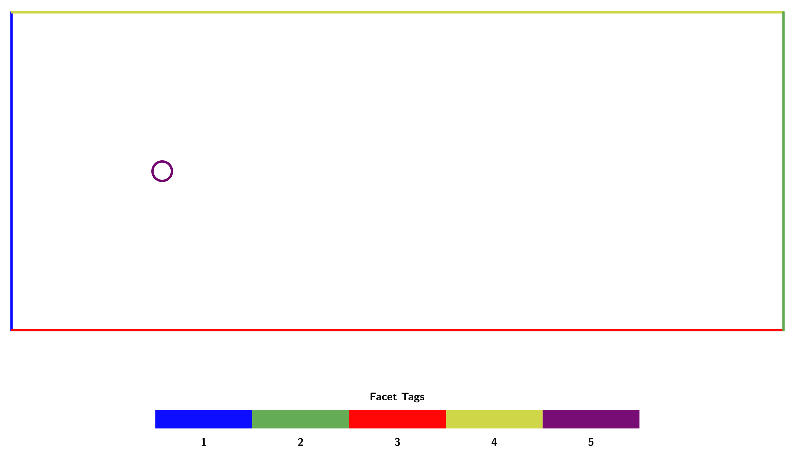

# LSA-FW FEM Boundary Conditions

> [Back to FEM Overview](fem.md)

---

## Introduction

Boundary conditions complete a partial differential equation by prescribing the behavior of the solution on the boundary $\partial\Omega$.

In LSA-FW they are specified declaratively and converted to structures that can be consumed by the finite-element assemblers.

From now on in this document, let $\partial\Omega = \Gamma_D \cup \Gamma_N \cup \Gamma_R$ be a partition into Dirichlet, Neumann, and Robin boundaries.
Note that periodic boundary conditions, in which degrees of freedom (DOFs) on two disjoint boundaries are identified and coupled, are also supported.

Formally: 

* Dirichlet conditions: prescribe values of the solution $u = u_D$ on $\Gamma_D$ and are imposed strongly.
* Neumann conditions: prescribe fluxes $\partial u/\partial n = g$ on $\Gamma_N$ and appear as natural terms in the weak formulation.
* Robin conditions: blend Dirichlet and Neumann data $\alpha u + \beta \partial u/\partial n = g$ on $\Gamma_R$.
They are treated as weak contributions with an additional coefficient $\alpha$.

> **Note:** Neumann and Robin boundary conditions are handled in *disassembled* form.
> Their contributions are not directly inserted into the system matrix or vector.
> Instead, the `define_bcs` routine returns the different elements of the boundary integrals in symbolic form, leaving it to the assembler to insert the relevant weak-form expressions.

In the finite element method, boundary conditions are essential to ensure well-posedness and physical relevance of the solution.

For elliptic and incompressible flow problems such as Stokes or Navier–Stokes, a variety of boundary types may arise depending on the physics being modeled:

* Dirichlet conditions are typically used to prescribe velocity on solid walls or inflow boundaries.
* Neumann conditions correspond to stress or flux balance, suitable for outflows or natural boundary segments.
* Robin conditions are hybrid constraints and arise naturally in stabilized formulations or as sponge terms in perturbation analysis.

In stability analysis of incompressible flows, boundary conditions affect both the base flow and the perturbation problem.
For instance, using a Robin condition with a large $\alpha$ on outflow boundaries can suppress spurious eigenmodes, by enforcing a sponge-like damping of velocity perturbations.

Mathematically, boundary conditions modify the variational space or appear as additional terms in the weak form.
In particular:

* Dirichlet conditions reduce the trial/test space to functions that satisfy the condition.
* Neumann and Robin conditions contribute to the right-hand side and, potentially, the system matrix.
* Periodic conditions impose topological constraints linking DOFs across disconnected boundary regions.

These considerations are crucial in both forward and linearized solvers, and particularly delicate when defining consistent adjoint or eigenvalue problems.

> For further reading, see "Theory and Practice of Finite Elements" by Ern & Guermond (2004) or "Finite Elements: Theory, Fast Solvers, and Applications" by Elman et al. (2005).

## Supported Types

The `BoundaryConditionType` enum provides a typed interface:

| Type                 | Description                                       |
| -------------------- | ------------------------------------------------- |
| `DIRICHLET_VELOCITY` | Strong velocity condition.                        |
| `DIRICHLET_PRESSURE` | Strong pressure condition.                        |
| `NEUMANN_VELOCITY`   | Weak velocity traction.                           |
| `NEUMANN_PRESSURE`   | Weak pressure flux.                               |
| `ROBIN`              | Weak Robin condition using a penalty coefficient. |
| `PERIODIC`           | DOF mapping between two tagged boundaries.        |

## API Overview

### `BoundaryCondition`

```python
BoundaryCondition(
    marker: int,
    type: BoundaryConditionType,
    value: float | tuple[int, int] | tuple[float, ...] | Callable[[np.ndarray], np.ndarray],
    robin_alpha: float | None = None,
)
```

Represents a single boundary condition.
The semantics of `value` depend on `type` and may be a scalar, a vector, two markers (for periodic BCs), or a callable evaluated at spatial coordinates.

Instances are typically created from configuration files via `BoundaryCondition.from_config`.

### `define_bcs`

```python
def define_bcs(
    mesher: Mesher,
    spaces: FunctionSpaces,
    configs: Sequence[BoundaryCondition],
) -> BoundaryConditions
```

Consumes a sequence of `BoundaryCondition` objects and returns a grouped `BoundaryConditions` container holding:

* `velocity` / `pressure`: strong Dirichlet conditions,
* `velocity_neumann` / `pressure_neumann`: data for weak Neumann terms,
* `robin_data`: tuples `(marker, alpha, g)` for Robin contributions, and
* `velocity_periodic_map` / `pressure_periodic_map`: DOF maps for periodic BCs.

> **Important:** The mesher must have facet markers defined via `mark_boundary_facets`.
> Otherwise, boundary conditions cannot be assigned to domain boundaries.
> Refer to [facet tagging](#facet-tagging).


#### `BoundaryConditions`

The resulting container is a dataclass with the following fields:

| Attribute                                        | Description                                              |
| ------------------------------------------------ | -------------------------------------------------------- |
| `velocity`, `pressure`                           | Lists of `(marker, dirichlet_bc)` pairs applied strongly |
| `velocity_neumann`, `pressure_neumann`           | `(marker, value)` pairs used in weak forms               |
| `robin_data`                                     | Tuples `(marker, alpha, g)` for Robin contributions      |
| `velocity_periodic_map`, `pressure_periodic_map` | DOF pairings for periodic constraints                    |

### Periodic Utilities

Periodic DOF maps are generated automatically during define_bcs, based on the `PERIODIC` condition configuration.
The resulting map can be applied to matrices or vectors with:

```python
apply_periodic_constraints(obj, periodic_map) -> None
```

which merges the paired entries in-place.

Example of applying periodic constraints to assembled operators:

```python
A, b = assemble_system(form_a, form_l, bcs.velocity)

for pmap in bcs.velocity_periodic_map:
    apply_periodic_constraints(A, pmap)
    apply_periodic_constraints(b, pmap)
```

## Facet Tagging

Facet tagging is essential to enable the assignment of boundary conditions.
Without facet markers, boundaries are not distinguishable, and no conditions can be applied to them.

Facet markers can be defined programmatically or loaded from a configuration file in TOML format.

```toml
# ./facets.toml

[[FaceTag]]
# Inlet
marker = 1
when = { axis = "x", equals = -20.0 }

[[FaceTag]]
# Outlet
marker = 2
when = { axis = "x", equals = 80.0 }

[[FaceTag]]
# Bottom
marker = 3
when = { axis = "y", equals = -20.0 }

[[FaceTag]]
# Top
marker = 4
when = { axis = "y", equals = 20.0 }

[[FaceTag]]
# Fallback for unmatched surfaces (e.g., cylinder)
marker = 5
otherwise = true
```

These rules are internally interpreted as a sequence of `FacetRule` objects with match conditions on the coordinate axes:

```python
facet_cfg = load_facet_config(_CFG_DIR / "facets.toml")
mesher = Mesher.from_geometry(Geometry.CYLINDER_FLOW, cylinder_cfg)
mesher.mark_boundary_facets(facet_cfg)
```

Each rule may match using:

* `equals`: matches if the coordinate equals the given value (within tolerance)
* `less_than`: matches if the coordinate is strictly smaller than a threshold
* `greater_than`: matches if the coordinate is strictly greater
* `otherwise = true`: fallback rule when no others match

The following figure shows a domain with properly tagged facets.



## Periodic Boundary Conditions

Periodic boundary conditions identify degrees of freedom (DOFs) across disconnected boundaries of the domain to enforce continuity in the solution. They are essential for modeling physically repeating domains, such as channel flows, and help eliminate artificial effects at domain boundaries.

In LSA-FW, periodic conditions are supported as a first-class type (`PERIODIC`) in the boundary condition configuration. Unlike Dirichlet or Neumann conditions, they do not alter the weak form directly but instead modify the assembled system post hoc to link DOFs across opposite boundaries.

Formally, a periodic boundary condition couples the solution across two facets $\Gamma_L$ and $\Gamma_R$ such that

$$
u|_{\Gamma_L} = u|_{\Gamma_R}.
$$

This constraint is enforced by identifying and merging corresponding DOFs on each boundary.
The match is assumed to follow a regular geometric transformation (e.g., translation in $x$).

This post-processing step modifies the global system matrix and right-hand side to reflect the topological constraint in the problem formulation.

### Implementation Notes

* Periodic conditions are configured declaratively by specifying a `value = [from_marker, to_marker]` pair in the boundary configuration file.
* During boundary processing (`define_bcs`), DOFs on the corresponding facet groups are identified and matched using geometric proximity.
* Matching is based on computing a translation vector between the centroids of the two boundary regions and pairing DOFs by nearest neighbor search.
* The resulting DOF mapping is stored separately in `velocity_periodic_map` and `pressure_periodic_map`.

These maps are not applied during the variational formulation but instead passed to the matrix/vector assembly routines, where they are applied after the system has been built.

### Solver Integration

After assembling the system matrix and RHS vector, periodic constraints are enforced in-place.
The procedure consists of:

1. Merging DOFs: Matrix rows and columns (or vector entries) associated with the "target" DOF are added into the "source" DOF.
2. Elimination: The target DOF is zeroed out and replaced with a diagonal identity entry to preserve invertibility.
3. Finalization: The modified PETSc matrix or vector is reassembled to ensure consistency.

This approach is fully compatible with PETSc-based solvers and avoids the need for custom constrained function spaces.

### Practical Considerations

* Periodic constraints must be applied after all other Dirichlet conditions and weak forms have been assembled.
* Care must be taken to ensure the geometry and mesh resolution are sufficiently symmetric so that DOFs can be matched within a given tolerance.
* The mechanism supports both scalar and vector-valued function spaces and is used in LSA-FW to simulate periodic channels and suppress artificial inflow/outflow dynamics in perturbation problems.

## Configuration Examples

Boundary conditions can be stored in a TOML file:

```toml
# ./bcs.toml

[[BC]]
marker = 1
type = "dirichlet_velocity"
value = [1.0, 0.0]

[[BC]]
marker = 2
type = "robin"
value = [0.0, 0.0]
robin_alpha = 10.0
```

Load the configuration and build the container:

```python
from pathlib import Path

from config import load_bc_config
from FEM.bcs import BoundaryCondition, define_bcs

path = Path("...")  # Path to bcs.toml

# Define mesh and function spaces [...] 

cfg = load_bc_config(path)
bcs = define_bcs(mesher, spaces, cfg)
```

### Common Use Cases

Below are typical configurations corresponding to physical boundary types:

#### No-Slip Wall

```toml
[[BC]]
marker = 3
type = "dirichlet_velocity"
value = [0.0, 0.0]
```

This imposes a homogeneous Dirichlet velocity, equivalent to a no-slip boundary.

#### Free Outflow

```toml
[[BC]]
marker = 2
type = "neumann_velocity"
value = [0.0, 0.0]
```

Zero traction (natural outflow) is encoded as a homogeneous Neumann velocity condition.

#### Robin Sponge

```toml
[[BC]]
marker = 4
type = "robin"
value = [0.0, 0.0]
robin_alpha = 10.0
```

When analyzing linearized perturbation systems, sponge terms can damp reflections at boundaries and reduce spurious modes.
This Robin condition approximates such damping using $\alpha (g - u)$ in weak form.
