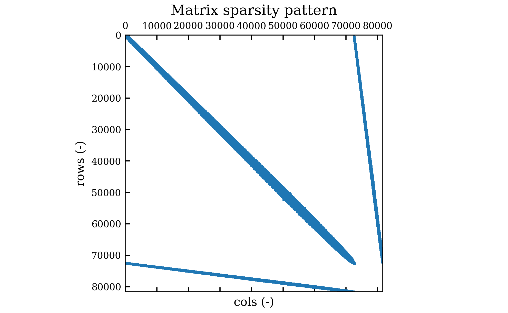

# LSA-FW FEM Linearized Navier-Stokes Operators

> [Back to FEM Overview](fem.md)

---

Linear stability analysis of fluid flows requires linearizing the Navier-Stokes equations around a given baseflow.
This module provides tools to assemble the discrete matrices for this linearized system using PETSc-compatible routines.

The central component is the `LinearizedNavierStokesAssembler` class, which encapsulates variational form construction and matrix assembly.

## Theoretical Background

Let $\overline{\mathbf{u}}, \overline{p}$ denote the base (steady) solution of the incompressible Navier-Stokes equations at Reynolds $\text{Re}$.
This baseflow, assumed divergence-free and satisfying the steady Navier-Stokes equations at Reynolds $\text{Re}$ is considered known, and thus, an input to the module.
Accordingly, the study of the linearized problem consists on the study of small perturbations on the flow, so that 

$$
 \left\lbrace
 \begin{aligned}
    &\mathbf{u}(\mathbf{x}, t) = \overline{\mathbf{u}}(\mathbf{x}) + \mathbf{u}'(\mathbf{x}, t)\\
    &p(\mathbf{x}, t) = \overline{p}(\mathbf{x}) + p'(\mathbf{x}, t)
\end{aligned}
\right..
$$

Perturbations $\mathbf{u}', p'$ satisfy the linearized system:

$$
\left\lbrace
\begin{aligned}
    s\mathbf{u}' + (\overline{\mathbf{u}}\cdot\nabla)\mathbf{u}' + (\mathbf{u}'\cdot\nabla)\overline{\mathbf{u}} &= -\nabla p' + \frac{1}{\text{Re}}\,\Delta \mathbf{u}' \\
    \nabla\cdot \mathbf{u}' &= 0
\end{aligned}
\right.,
$$

where $s$ is the temporal growth rate.
For time evolution, replace $s \mathbf{u}'$ with $\partial_t \mathbf{u}'$.

| Term                        | Expression                                  | Description                                                                                  |
|-----------------------------|---------------------------------------------|----------------------------------------------------------------------------------------------|
| Growth rate term            | $s\mathbf{u}'$                             | Represents temporal evolution; in eigenanalysis, $s$ is the spectral growth rate; in time-dependent simulations, it corresponds to $\partial_t \mathbf{u}'$. |
| Convection term             | $(\overline{\mathbf{u}}\cdot\nabla)\mathbf{u}'$       | Advection of the perturbation by the baseflow; transports momentum downstream.              |
| Shear term                  | $(\mathbf{u}'\cdot\nabla)\overline{\mathbf{u}}$       | Interaction of the perturbation with baseflow gradients; captures the effect of baseflow shear on perturbation dynamics. |
| Pressure gradient term      | $-\nabla p'$                               | Pressure force acting on the perturbation velocity field; contributes to acceleration and enforces incompressibility. |
| Viscous diffusion term      | $\frac{1}{\text{Re}}\,\Delta \mathbf{u}'$         | Represents momentum diffusion due to viscosity; forms a symmetric positive semi-definite operator. |
| Divergence (continuity) term| $\nabla\cdot \mathbf{u}'$                  | Enforces incompressibility of the perturbation velocity field; couples velocity and pressure in a saddle-point system. |

In a finite element context, suitable [function spaces](fem-spaces.md) are chosen.
From now on in this document, $V$ is used for the velocity (vector) field, and $Q$ is used for the pressure (scalar) field. 

Let $\mathbf{v}$ be a test function in $V$ and $q$ be a test function in $Q$.
Then, the bilinear forms associated with each term in the linearized Navier–Stokes equations are defined below.
These forms are assembled into discrete operators acting on the velocity and pressure function spaces.

### Mass Form

$$
m(\mathbf{u}, \mathbf{v}) = \int_\Omega \mathbf{u} \cdot \mathbf{v}\,dx
$$

This bilinear form defines the velocity mass matrix $M_v$, which is block-diagonal in many finite element bases.
It is used to represent the $s\mathbf{u}$ term in eigenproblems or $\partial_t \mathbf{u}$ in time evolution.
Since pressure does not evolve in time, the full mass matrix is block-diagonal with zero entries in the pressure-pressure block.

### Convection Form

$$
a_{\text{conv}}(\mathbf{u}, \mathbf{v}) = \int_\Omega ((\overline{\mathbf{u}}\cdot\nabla)\mathbf{u}) \cdot \mathbf{v}\,dx
$$

This non-symmetric form contributes to the convection matrix $C_1$.

### Shear Form

$$
a_{\text{shear}}(\mathbf{u}, \mathbf{v}) = \int_\Omega ((\mathbf{u}\cdot\nabla)\overline{\mathbf{u}}) \cdot \mathbf{v}\,dx
$$

This form defines the shear matrix $C_2$.

### Pressure Coupling Forms

From the pressure gradient and continuity terms, integration by parts leads to:

$$
b(\mathbf{v}, p) = -\int_\Omega p\,(\nabla\cdot \mathbf{v})\,dx,
\qquad
b^T(\mathbf{u}, q) = \int_\Omega q\,(\nabla\cdot \mathbf{u})\,dx
$$

These define the gradient operator $G$ and divergence operator $D$, coupling pressure and velocity in the saddle-point structure.
For compatible function spaces, the discrete operators satisfy $D = -G^T$ up to a sign convention.

### Viscous Form

$$
a_{\text{visc}}(\mathbf{u}, \mathbf{v}) = \frac{1}{\text{Re}}\int_\Omega \nabla \mathbf{u} : \nabla \mathbf{v}\,dx
$$

Here, the colon '$:$' denotes the Frobenius inner product (or double contraction) between the velocity gradient tensors, defined as

$$
\nabla \mathbf{u} : \nabla \mathbf{v} = \sum_{i,j} \frac{\partial u_i}{\partial x_j} \frac{\partial v_i}{\partial x_j}
$$

This symmetric bilinear form yields the diffusion (stiffness) matrix for the velocity field, modeling viscous dissipation via the Laplacian operator.

### Physical Interpretation

The viscous term $a_{\text{visc}}$ yields a symmetric positive semi-definite stiffness matrix that models momentum diffusion and dissipative effects.
The convection and shear terms, $a_{\text{conv}}$ and $a_{\text{shear}}$, collectively define the linearized advection operator, and are responsible for non-self-adjoint behavior when the baseflow is nonzero.

The pressure and continuity terms enforce the incompressibility constraint, coupling velocity and pressure through a saddle-point system with a nullspace in pressure.
The mass form $m$ accounts for temporal evolution or eigenvalue scaling and is essential for both time-marching and spectral stability analyses.

## Discrete System Structure

The full discrete system takes the block form:

$$
\begin{bmatrix}
    s\mathbf{M} + \mathbf{C}_1 + \mathbf{C}_2 + \mathbf{B} + \mathbf{R} & \mathbf{G} \\
    \mathbf{D} & 0
\end{bmatrix}
\begin{bmatrix}
    \mathbf{u} \\
    p
\end{bmatrix} =
\begin{bmatrix}
    0 \\
    0
\end{bmatrix}
$$

where

* $\mathbf{M}$ is the velocity mass matrix,
* $\mathbf{C}_1$, $\mathbf{C}_2$ are convection and shear matrices,
* $\mathbf{B}$ is the viscous (stiffness) matrix,
* $\mathbf{R}$ is optional Robin damping,
* $\mathbf{G}$ is the pressure gradient operator,
* $\mathbf{D}$ is the divergence operator.

> **Note:** Only homogeneous Neumann and Robin terms are supported in this eigenproblem formulation.

The assembled matrices are highly sparse, especially in large-scale problems with second-order or higher-order elements.
It is essential to use sparse matrix formats and sparse-aware solvers and preconditioners (e.g., Krylov subspace solvers in PETSc or eigensolvers in SLEPc).
Dense representations should be avoided due to memory and performance constraints.

As an example, the following figure shows the sparsity pattern of the linear operator matrix for the cylinder-flow case:




## Nullspace Management

In incompressible flow, pressure is defined up to an additive constant.
The resulting matrix has a nullspace corresponding to constant pressure modes.

When no pressure Dirichlet condition is applied, this nullspace must be explicitly handled (this is usually done by either explicitly attaching it to assembled PETSc matrices or by pinning DOFs.)

Failing to do so may lead to divergence in Krylov solvers like MINRES, spurious near-zero eigenvalue in spectral computations or ill-conditioned or singular matrices.

Internally, the nullspace is defined by creating a vector $v$ with 1.0 on all pressure DOFs and 0.0 elsewhere, then normalizing:

```python
arr[dofs_p] = 1.0
vec = iPETScVector.from_array(arr)
vec.scale(1 / vec.norm)
```

A PETSc `NullSpace` is created from this vector and attached using:

```python
nullspace.attach_to(matrix)
```

This approach is compatible with both solvers and eigensolvers.

## API Reference

### `LinearizedNavierStokesAssembler`

```python
LinearizedNavierStokesAssembler(
    base_flow: dfem.Function,
    spaces: FunctionSpaces,
    re: float,
    *,
    bcs: BoundaryConditions | None = None,
    tags: MeshTags | None = None,
)
```

* `base_flow`: DolfinX mixed-function $(\overline{\mathbf{u}}, \overline{p})$
* `spaces`: `FunctionSpaces` container with velocity-pressure spaces (and the mixed space)
* `re`: Reynolds number
* `bcs`: Optional boundary conditions (Dirichlet, periodic, Robin, Neumann)
* `tags`: Optional facet tags

#### Methods

| Method                        | Description                                     |
| ----------------------------- | ----------------------------------------------- |
| `assemble_linear_operator()`  | Returns the full operator matrix $A$          |
| `assemble_mass_matrix()`      | Returns mass matrix $M$ (block-diagonal)      |
| `assemble_eigensystem()`      | Returns tuple $(A, M)$ for eigenvalue solvers |
| `clear_cache()`               | Clears internal matrix cache                    |
| `attach_pressure_nullspace()` | Manually attach nullspace to matrix             |
| `extract_subblocks()`         | Extract (vv, vp, pv, pp) from mixed matrix      |

## Usage Example

```python
from FEM.operators import LinearizedNavierStokesAssembler
from FEM.spaces import define_spaces
from FEM.bcs import define_bcs
from Meshing.core import Mesher
from config import load_cylinder_flow_config, load_bc_config, load_facet_config

# Load mesh and tags
cfg = load_cylinder_flow_config("geometry.toml")
facet_markers = load_facet_config("facets.toml")

mesher = Mesher.from_geometry(Geometry.CYLINDER_FLOW, cfg)
mesher.mark_boundary_facets(facet_markers)

# Define function spaces
spaces = define_spaces(mesher.mesh, FunctionSpaceType.TAYLOR_HOOD)

# Load BCs for baseflow and perturbation
bcs = define_bcs(mesher, spaces, load_bc_config("bcs.toml"))
bcs_pert = define_bcs(mesher, spaces, load_bc_config("bcs_perturbation.toml"))

# Load or compute baseflow
baseflow = load_baseflow("baseflow/re_40", spaces)

# Assemble eigensystem
assembler = LinearizedNavierStokesAssembler(
    base_flow=baseflow,
    spaces=spaces,
    re=40.0,
    bcs=bcs_pert,
    tags=mesher.facet_tags,
)
A, M = assembler.assemble_eigensystem()
```

## Notes

* Matrices are cached automatically after first assembly.
* Use `CacheStore` to persist matrices across runs.
* Periodic constraints are applied after assembly.
