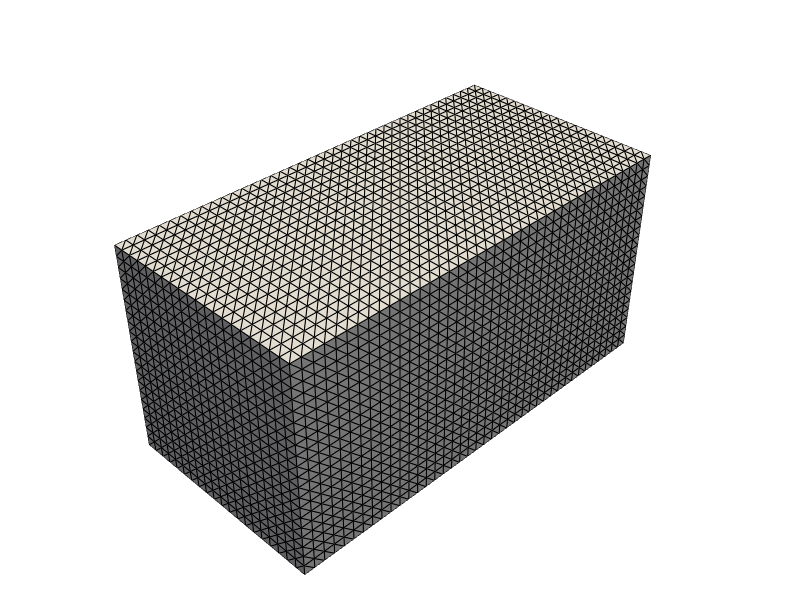
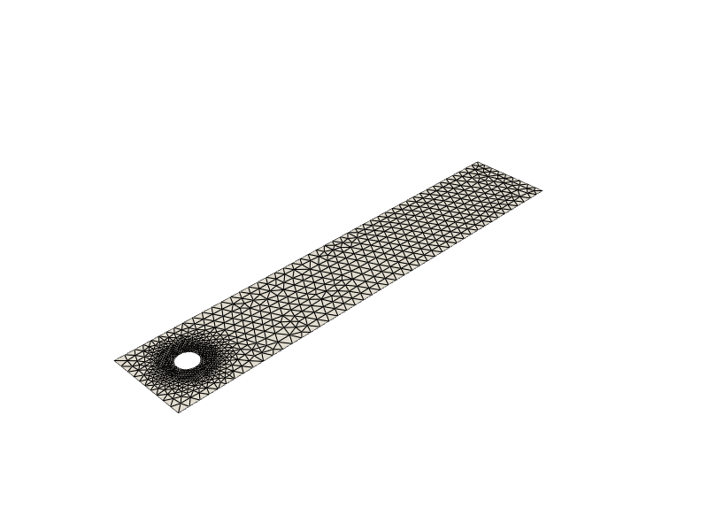

# LSA-FW Meshing Module

> [Back to index](_index.md)

---

## Purpose

The `Meshing` module provides a unified and extensible interface for mesh generation, import/export and visualization within the LSA-FW framework.

Additionally, it provides standardized CFD benchmark geometries such as cylinder and step flow.

## Contents

### Module Structure

| File                  | Purpose                                                                 |
|-----------------------|-------------------------------------------------------------------------|
| `core.py`             | Main API via the `Mesher` class                                         |
| `geometries.py`       | Benchmark geometry generators (2D/3D, with local refinement support)    |
| `cli.py`              | CLI wrapper for all supported actions (generate, import, benchmark)     |
| `plot.py`             | Mesh visualization using PyVista                                        |
| `utils.py`            | Common enums for shape, cell types, formats, benchmark geometry names   |


## API Reference

### `Mesher` class (in `core.py`)

```python
Mesher(shape: Shape, n: tuple[int], cell_type: iCellType, domain: Optional[tuple[tuple[float], tuple[float]]] = None, custom_file: Optional[pathlib.Path] = None, gdim: Optional[int] = None)
```

#### Methods

- `generate() -> Mesh`: Procedurally generate the mesh.
- `export(path: Path, format: Format)`: Export the mesh to disk.
- `mesh: Mesh`: Property that returns the generated mesh.
- `from_file(path: Path, shape: Shape, gdim: int) -> Mesher`: Alternative constructor for `.msh` or `.xdmf` imports.

#### Supported Shaoes

- `unit_interval`, `unit_square`, `unit_cube`, `box`, `custom_msh`, `custom_xdmf`.

### Enums (in `utils.py`)

- `Shape`: Basic shapes and import types.
- `Format`: Export formats (XDMF, VTK, GMSH).
- `iCellType`: Internal wrapper around `dolfinx.mesh.CellType` with better CLI compatibility.
- `Geometry`: Names of supported CFD benchmark geometries (`cylinder_flow`, `step_flow`).

### Visualization (in `plot.py`)

- `plot_mesh(mesh: Mesh, mode='interactive', show_edges=True, ...)`: PyVista-based visualization.
- `get_mesh_summary(mesh: Mesh)`: Bounding box and size summary.


## Benchmark Geometries

The `geometries` module provides functions that generate pre-defined CFD domains compatible with LSA-FW.

All the supported geometries are callable via the public API (`get_geometry` method and `Geometry` enum):

```python
from Meshing.geometries import get_geometry
from Meshing.utils import Geometry

mesh = get_geometry(Geometry.CYLINDER_FLOW, **params)
```

### Flow Around a Cylinder

- Supports both 2D and 3D channels.
- Generates a circular obstacle inside a rectangular or box-shaped domain.
- Supports mesh refinement near the cylinder surface.

Example config file:
```json
{
  "length": 2.2,
  "height": 0.41,
  "cylinder_radius": 0.05,
  "cylinder_center": [0.2, 0.2],
  "resolution": 0.05,
  "resolution_cylinder": 0.01,
  "influence_radius": 0.15
}
```

### Step Flow

- Generates a backward-facing step channel.
- 2D and 3D support via extrusion.


## CLI Integration

The following command can be used for more detailed help:

```bash
python -m Meshing --help
```

### Subcommands

```bash
python -m Meshing <subcommand> [options]
```

#### `generate`: built-in shapes

```bash
--shape unit_square --cell-type triangle --resolution 32 32 ...
```

#### `import`: external mesh

```bash
--from custom_xdmf --path mesh.xdmf ...
```

#### `benchmark`: predefined CFD geometries

```bash
--geometry cylinder_flow --params params/cylinder2d.json ...
```

### Examples

Generate (and plot) a 3D hexahedral mesh over a custom box domain (0,0,0) to (2,1,1):

```bash
python -m Meshing -p generate \
    --shape box \
    --cell-type hexahedron \
    --resolution 40 20 20 \
    --domain 0 0 0 2 1 1 \
    --export box_mesh.xdmf \
    --format xdmf
```



---

Import a GMSH-generated `.msh` mesh and convert it to VTK for visualization:

```bash
python -m Meshing import \
    --from custom_msh \
    --path meshes/input.msh \
    --export meshes/output.vtk \
    --format vtk \
```

---

Generate (and plot) a 2D cylinder flow mesh from a JSON configuration file with local refinement, and export it as XDMF:

```bash
python -m Meshing -p benchmark \
    --geometry cylinder_flow \
    --params params/cylinder2d.json \
    --export cylinder.xdmf \
    --format xdmf \
```



## Design/Implementation Notes

### Geometry Design

- 2D uses `geo` interface and defines geometry via `addPoint`, `addLine`, `addCircleArc`, etc.
- 3D uses `occ` interface to build geometry via `addBox`, `addCylinder`, `cut`, and `extrude`.
- Local refinement is automatically performed.
- Physical tagging is added consistently for downstream FEM support.

### CLI Design

- Argument validation (e.g., resolution match with domain size)
- CLI output is formatted with `rich.logging` for clean diagnostics
- Compatible with automation: accepts JSON files for benchmark geometries

### Parallel Support

- Mesh export uses `XDMFFile` or `VTKFile`, both parallel-safe


## Future Work

- Export to GMSH format (`.msh`)
- Geometric tagging beyond just `"Fluid"` (e.g., `"Inlet"`, `"Wall"`)
- Support for inflow/outflow BC boundaries in CFD geometries
