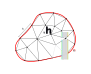

# LSA-FW Meshing Module

> [Back to index](_index.md)

---

## Introduction

Mesh generation is a foundational step in any finite element or finite volume simulation framework.
In the context of LSA-FW, the `Meshing` module provides automated, programmable, and benchmark-ready tools to discretize simple and complex domains.

For now on in the documentation, a 'mesh' (or grid) refers to a finite decomposition of a continuous domain $\Omega \subset \mathbb{R}^d$ into non-overlapping subdomains (referred to as 'elements') such as intervals, triangles, quadrilaterals, tetrahedra, or hexahedra.

Formally, let $\mathcal{T}_h = \{K_i\}_{i=1}^N$ denote a conforming mesh, where

* $K_i \subset \Omega$ are closed, non-overlapping elements,
* $h = \max_{K \in \mathcal{T}_h} \text{diam}(K)$ is the mesh size, and
* $\mathcal{T}_h$ is shape-regular and locally quasi-uniform (optional but common assumptions).

This definition is also represented in the figure below.

Within the framework, the meshes generated by the `Meshing` module shall:

* Approximate the geometry of the domain $\Omega$
* Encode topological information (i.e., connectivity, boundaries and facets)
* Be suitable for discretizing partial differential equations 

## Module Architecture

The `Meshing` module is designed to provide

* a unified interface for generating or importing meshes,
* support for CFD benchmark domains relevant to linear stability analyses, and
* automated adaptive refinement for increased fidelity in key regions of the domain.

### Submodule Overview

| Submodule       | Role                                                                  |
| --------------- | --------------------------------------------------------------------- |
| `core.py`       | Main interface for procedural generation and I/O                      |
| `geometries.py` | Parameterized generation of benchmark CFD domains                     |
| `adapt.py`      | Adaptive meshing based on physical criteria (e.g., baseflow)          |
| `cli.py`        | Command-line interface and argument parsing                           |
| `plot.py`       | Mesh visualization                                                    |
| `utils.py`      | Enumerations and type wrappers for user input (shapes, formats, etc.) |

## CFD Benchmark Geometries

The `Meshing` module allows to create benchmark geometries in order to provide standardized domains with the following objectives:

* Reproducibility of simulation results (extended literature reference)
* Comparative studies of stability modes
* Controlled evaluation of mesh sensitivity

The `geometries.py` module includes factory functions to generate meshed domains.

### Supported Cases

#### Cylinder Flow

This domain represents flow over a circular cylinder in a confined rectangular channel.
It is commonly used in 2D and 3D benchmark studies.

The whole geometry is fully parametrizable:

* `x_range`: total streamwise domain size $L$
* `y_range`: total height of the channel $H$
* `z_range`: total width of the channel $W$
* `cylinder_radius`: radius $R$ of the circular obstacle
* `cylinder_center`: coordinates $(x_c, y_c)$

Additionally, the mesh can be configured via the following parameters:

* `resolution`: base resolution for background mesh
* `resolution_around_cylinder`: local refinement near the cylinder
* `influence_radius`: radius around the cylinder to apply local refinement
* `influence_length`: length after the cylinder to apply local refinement
