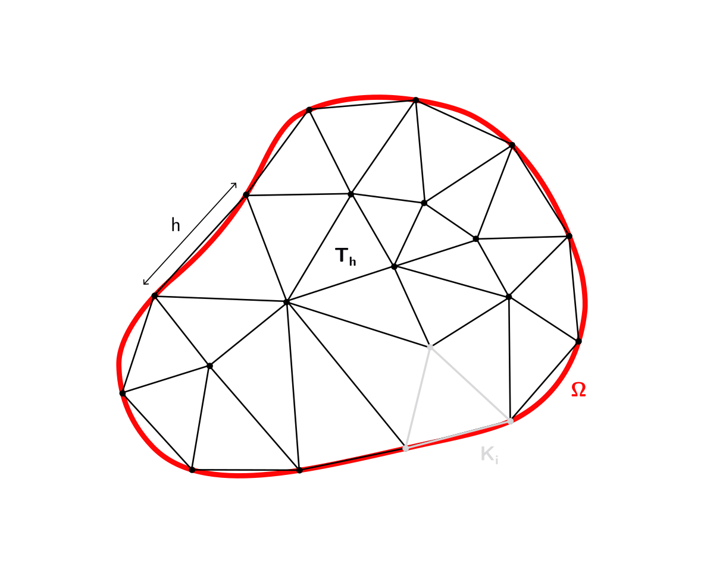
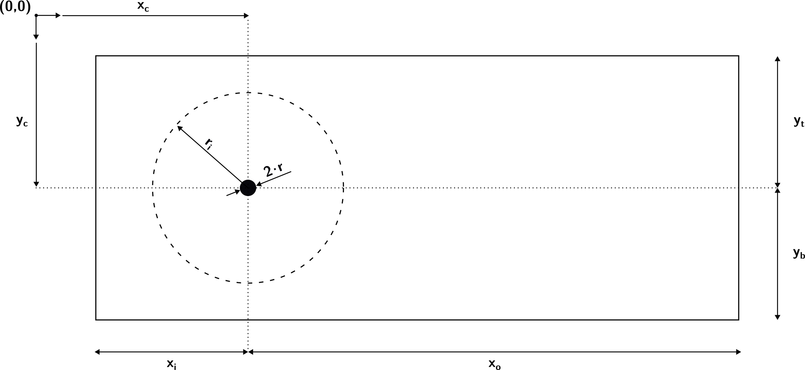
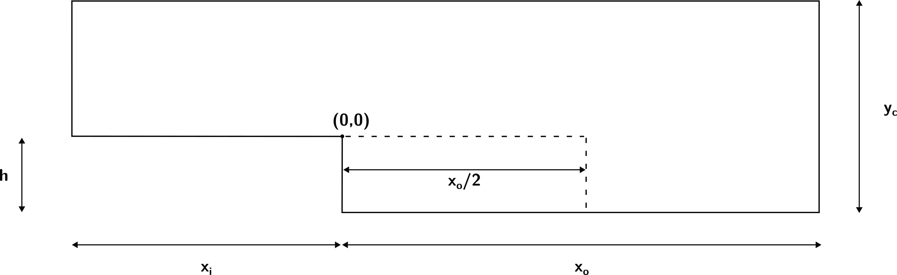
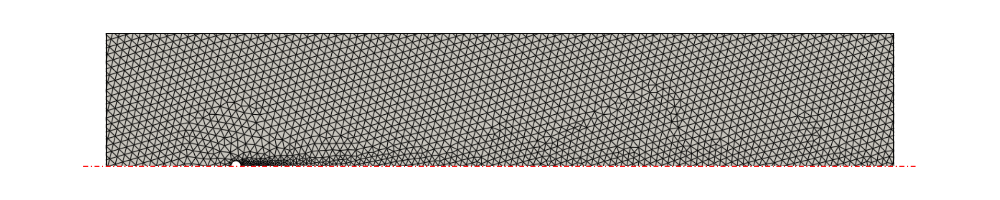

# LSA-FW Meshing Module

> [Back to index](_index.md)

---

## Introduction

Mesh generation is a foundational step in any finite element or finite volume simulation framework.
In the context of LSA-FW, the `Meshing` module provides automated, programmable, and benchmark-ready tools to discretize simple and complex domains.

For now on in the documentation, a 'mesh' (or grid) refers to a finite decomposition of a continuous domain $\Omega \subset \mathbb{R}^d$ into non-overlapping subdomains (referred to as 'elements') such as intervals, triangles, quadrilaterals, tetrahedra, or hexahedra.

Formally, let

$$
\mathcal{T}_ h = [K_i]_{i=1}^N
$$

denote a conforming mesh, where

* $K_i \subset \Omega$ are closed, non-overlapping elements,
* $h = \max_{K \in \mathcal{T}_h} \text{diam}(K)$ is the mesh size, and
* $\mathcal{T}_h$ is shape-regular and locally quasi-uniform (optional but common assumptions).

This definition is also represented in the figure below.



Within the framework, the meshes generated by the `Meshing` module shall:

* Approximate the geometry of the domain $\Omega$
* Encode topological information (i.e., connectivity, boundaries and facets)
* Be suitable for discretizing partial differential equations 


## Module Architecture

The `Meshing` module is designed to provide

* a unified interface for generating or importing meshes,
* support for CFD benchmark domains relevant to linear stability analyses, and
* automated adaptive refinement for increased fidelity in key regions of the domain.

### Submodule Overview

| Submodule       | Role                                                                  |
| --------------- | --------------------------------------------------------------------- |
| `adapt.py`      | Adaptive meshing based on physical criteria (e.g., baseflow)          |
| `cli.py`        | Command-line interface and argument parsing                           |
| `core.py`       | Main interface for procedural generation and I/O                      |
| `geometries.py` | Parameterized generation of benchmark CFD domains                     |
| `plot.py`       | Mesh visualization                                                    |
| `utils.py`      | Enumerations and type wrappers for user input (shapes, formats, etc.) |

## CFD Benchmark Geometries

The `Meshing` module allows to create benchmark geometries in order to provide standardized domains with the following objectives:

* Reproducibility of simulation results (extended literature reference)
* Comparative studies of stability modes
* Controlled evaluation of mesh sensitivity

The `geometries.py` module includes factory functions to generate meshed domains.

All the supported cases can be configured via configuration files (in `*.toml` format), making it very easy to create serialized test cases, or fine-tune geometric parameters. 
The recommended pipeline is to define all the parameters in a configuration file, and use the utilities in `config.py` to load them:

**Example configuration file**:

```toml
# ./geometry.toml

dim = 2
cylinder_radius = 0.5
cylinder_center = [0.0, 0.0]
x_range = [-20.0, 80.0]
y_range = [-20.0, 20.0]
resolution = 0.75
resolution_around_cylinder = 0.10
influence_radius = 40
influence_length = 40
```

**Example loading script**:

```python
from pathlib import Path

from config import load_cylinder_flow_config
from Meshing.geometries import , Geometry, get_geometry

path_to_toml = Path(...)  # Path to geometry.toml

cylinder_config = load_cylinder_flow_config(path_to_toml)
mesh = get_geometry(Geometry.CYLINDER_FLOW, cylinder_config)
```

### Supported Cases

#### Cylinder Flow

This domain represents flow over a circular cylinder in a confined rectangular channel.
It is commonly used in 2D and 3D benchmark studies.

The whole geometry is fully parametrizable:

* `x_range`: domain limits in the X-axis with respect to the origin — $[-x_i, x_o]$
* `y_range`: domain limits in the Y-axis with respect to the origin — $[-y_b, y_t]$
* `z_range`: domain limits in the Z-axis with respect to the origin
* `cylinder_radius` — $r$
* `cylinder_center`: position of the axis of the cylinder with respect to the origin — $(x_c, y_c)$

Additionally, the mesh can be configured via the following parameters:

* `resolution`: base resolution for background mesh
* `resolution_around_cylinder`: local refinement near the cylinder
* `influence_radius`: radius around the cylinder to apply local refinement — $r_i$

In the following figure, an schematic representation of the cylinder flow domain with the above mentioned parameters can be seen.




#### Step Flow

This domain represents a backward-facing step.
It is useful for reattachment, separation and mode transition studies.

The whole geometry is fully parametrizable:

* `inlet_length` — $x_i$
* `step_height` — $h$
* `outlet_length` — $x_o$
* `channel_height`: total height of the channel (i.e., step and inlet) — $y_c$

Additionally, the mesh can be configured with the following parameters:

* `resolution`: base resolution for background mesh
* `refinement_factor`: refinement factor (i.e., how many times finer is the mesh in the refinement area)

Note that automatic refinement is implemented in half of the length of the outlet domain.

In the following figure, an schematic representation of the step flow domain with the above mentioned parameters can be seen.



## Adaptive Meshing

Mesh adaptivity plays a crucial role in the accurate simulation and stability analysis of fluid flows.
In global stability problems, regions of high velocity gradient, vorticity, or instability sensitivity require finer resolution to accurately capture spatial modes and associated eigenvalues.

The current adaptive strategy is based only on the steady baseflow solution obtained over a coarse initial mesh.
However, future work is planned in order to enhance mesh refinement:

* Vorticity-driven refinement: using $\omega = \nabla \times \mathbf{u}_b$
* Adjoint-based sensitivity: refining regions of high sensitivity of eigenvalues to baseflow perturbations
* Mode-driven: leveraging previously computed global modes to guide refinement

The workflow is as follows:

1. Solve the baseflow (e.g., via steady Navier–Stokes) on a baseline mesh.
Refer to the [baseflow solver section](baseflow.md).
2. Compute refinement indicators based on the baseflow field, typically:
   * Velocity gradients
   * Magnitude of velocity
   * Distance to boundaries or obstacles
3. Regenerate mesh using a refinement field (based on step 2), typically expressed as a spatially varying resolution function.

This method allows high-fidelity resolution near key flow structures such as shear layers, recirculation zones, and obstacle wakes.

As an example, the following figure shows the outputted adapted mesh, based on the resolved velocity magnitude field of the baseflow for the flow over a cylinder (the boundary conditions and physical constraints are now irrelevant).
The red dotted line represents a symmetry axis.



## Public API and Usage Examples

### Python Scripting

The `Mesher` API allows programmatic mesh generation, import, and export directly in Python.
For example:

```python
from Meshing.core import Mesher
from Meshing.utils import Shape, iCellType, Format

# Create a 2D triangular mesh on the unit square [0,1] x [0,1] with a 32x32 grid
mesher = Mesher(shape=Shape.UNIT_SQUARE, n=(32, 32), cell_type=iCellType.TRIANGLE)
mesher.generate()  # Generate the mesh

# Optionally, mark boundary facets (e.g., tag left boundary as 1 and others as 2)
mesher.mark_boundary_facets(lambda x: 1 if x[0] < 1e-6 else 2)

mesher.export("unit_square.xdmf", Format.XDMF)  # Export mesh to an XDMF file
```

The above code creates a uniform triangular mesh on a unit square domain.
After calling `generate()`, the mesh can be further processed (e.g., applying boundary markers with `mark_boundary_facets`) and then saved to disk in a chosen format.

### CLI Usage

All meshing functionality is also accessible via a command-line interface for automation and scripting.
Running the module with `--help` will show all options:

```bash
python -m Meshing --help
```

The CLI provides three subcommands: `generate`, `import`, and `benchmark`.

#### Built-in Shapes (`generate`)

Generate a structured mesh for a simple shape (interval, square, cube, or custom box):

```bash
python -m Meshing generate \
    --shape unit_cube \
    --cell-type tetrahedron \
    --resolution 10 10 10
```

The above command creates a 3D unit cube mesh with a 10×10×10 cell division using tetrahedral elements.
You can also specify `--domain` for non-unit domains (when using `Shape.BOX`) and use `--export` and `--format` to save the mesh (e.g., XDMF or VTK).
If a facet marker configuration is available, include `--facet-config path/to/facets.toml` to automatically tag boundary facets.

#### Import from File (`import`)

Import an existing mesh from a file (supported formats: XDMF or Gmsh `.msh`) and optionally export it in a different format:

```bash
python -m Meshing import \
    --path mesh.msh \
    --export mesh.vtk \
```

This will read `mesh.msh` (a Gmsh format mesh) and convert it to `mesh.vtk` for visualization.
The `--gdim` flag can be provided if the geometric dimension cannot be inferred.

#### Benchmark Geometry (`benchmark`)

Generate a standard CFD benchmark geometry using a configuration file for parameters:

```bash
python -m Meshing benchmark \
    --geometry cylinder_flow \
    --config params/cylinder.toml \
    --export cylinder.xdmf \
```

In this example, a flow around a cylinder mesh is generated according to the parameters in `params/cylinder.toml` (which might specify domain size, cylinder radius, refinements, etc.), then exported to `cylinder.xdmf`.
Similarly, `--geometry step_flow` can be used for a backward-facing step configuration.

## API Reference

### `Mesher` Class (in `core.py`)

**Signature:**

```python
Mesher(shape: Shape, 
       n: tuple[int, ...], 
       cell_type: iCellType, 
       domain: tuple[tuple[float, ...], tuple[float, ...]] | None = None, 
       custom_file: Path | None = None, 
       gdim: int | None = None)
```

**Description:**

Primary interface for mesh generation and I/O.
A `Mesher` can procedurally generate simple domain meshes, import meshes from file, and export meshes to various formats.

**Key Methods:**

* **`generate(comm: MPI.Intracomm = MPI.COMM_WORLD) -> Mesh`** – Generate the mesh according to the specified shape and parameters.
For built-in shapes, this creates the mesh in memory.
* **`export(path: Path, format: Format) -> None`** – Export the generated mesh to a file.
Supports formats defined in the `Format` enum (e.g., XDMF for parallel I/O, VTK for visualization). Raises an error if called before a mesh is generated.
* **`mesh`** (property) – The internally stored `dolfinx.Mesh` object.
Available after `generate()` or after importing a mesh via `from_file`/`from_geometry`.
* **`mark_boundary_facets(marker_fn: Callable[[np.ndarray], int]) -> None`** – Apply integer markers to all exterior facets using a user-provided function.
The function is passed each facet's midpoint coordinate and should return an `int` label.
This populates the `Mesher.facet_tags` attribute, which can be used for setting boundary conditions.
* **`from_file(path: Path, shape: Shape, gdim: int) -> Mesher`** (class method) – Construct a `Mesher` by loading a mesh from an XDMF or MSH file.
The `shape` should be `Shape.CUSTOM_XDMF` or `Shape.CUSTOM_MSH` accordingly, and `gdim` specifies the geometry dimension of the mesh.
Internally calls `generate()` to read the file.
* **`from_mesh(mesh: Mesh, facet_tags: MeshTags | None = None, cell_tags: MeshTags | None = None) -> Mesher`** (class method) – Wrap an existing `dolfinx.mesh.Mesh` (and optional facet/cell tags) in a `Mesher` object.
This is useful if a mesh is created by other means and one wants to use `Mesher` methods on it (for example, to export or visualize it).
* **`from_geometry(geometry: Geometry, cfg: GeometryConfig, comm: MPI.Intracomm = MPI.COMM_WORLD) -> Mesher`** (class method) – Generate a mesh from a benchmark geometry (see `get_geometry` below) and return a `Mesher` containing it.
This automates the process of calling `get_geometry` and wrapping the result in a `Mesher`.
Typically used for CFD benchmark setups.

**Supported Shapes:** (`Shape` enum in `utils.py`)
Basic preset domains or mesh import types that can be used with `Mesher.shape`:

* `UNIT_INTERVAL` – 1D unit line $[0,1]$ (requires `n=(nx,)` and `cell_type=INTERVAL`).
* `UNIT_SQUARE` – 2D unit square $[0,1]$×$[0,1]$.
* `UNIT_CUBE` – 3D unit cube $[0,1]^3$.
* `BOX` – Axis-aligned rectangular domain with custom bounds (2D or 3D, specified via `domain=((xmin, ymin, [zmin]), (xmax, ymax, [zmax]))`).
* `CUSTOM_XDMF` – Import a mesh from an XDMF file (`custom_file` must be provided).
* `CUSTOM_MSH` – Import a mesh from a Gmsh `.msh` file (`custom_file` must be provided).

> Note: `Shape.PREDEFINED` is an internal option used when wrapping externally generated meshes.

### Benchmark Geometry API (`geometries.py`)

```python
get_geometry(geometry: Geometry, cfg: GeometryConfig, comm: MPI.Intracomm) -> dolfinx.Mesh
```

**Description:**

Dispatch function to generate a mesh for a given CFD benchmark geometry.
This reads the parameters from a configuration object and produces a fully-meshed domain (with any refinements and physical tags applied).
Typically used through `Mesher.from_geometry` or via the CLI `benchmark` command.

### Enums and Configurations (`utils.py`)

* **`Shape`** – Enumeration of basic shapes and mesh import types.
Used to select built-in domains (`UNIT_INTERVAL`, `UNIT_SQUARE`, `UNIT_CUBE`, `BOX`) or external mesh inputs (`CUSTOM_XDMF`, `CUSTOM_MSH`).
* **`Format`** – Enumeration of supported mesh export formats: `XDMF` (recommended for parallel I/O), `VTK` (ParaView/VTK format), and `GMSH` (Gmsh format, if implemented).
* **`iCellType`** – Internal cell type enum mapping human-friendly names to Dolfinx cell types.
Options include `TRIANGLE`, `QUADRILATERAL`, `TETRAHEDRON`, `HEXAHEDRON`, etc.
This wrapper allows specifying cell shapes in the CLI and code more conveniently (since Dolfinx's `CellType` is not a standard Python `Enum`).
* **`Geometry`** – Enum for supported benchmark geometries.
Currently includes `CYLINDER_FLOW` (flow around cylinder in a channel) and `STEP_FLOW` (backward-facing step).
This is used to select the case in `get_geometry` or CLI.

### Visualization Utilities (`plot.py`)

* **`plot_mesh(mesh, mode="interactive", show_edges=True, color="white", background="transparent", window_size=(800,600), screenshot_path=None, tags=None) -> None`** – Render the given mesh using PyVista.
By default, it launches an interactive window (`mode="interactive"`) with edges shown.
If `screenshot_path` is provided (PNG or SVG), it will render off-screen and save an image.
The `tags` argument can be a `MeshTags` object (such as boundary or cell markers) to overlay colored regions for visualization.
*(This function is MPI-aware: in parallel runs, it gathers the mesh to rank 0 for plotting.)*

* **`get_mesh_summary(mesh) -> dict`** – Compute basic information about a mesh, returning a dictionary with keys such as `"dimension"` (topological dimension of the mesh), `"num_cells"` (total number of cells/elements), `"num_vertices"` (total mesh vertices), and `"bounding_box"` (min and max coordinates in each dimension).
This is useful for logging or quick diagnostics.

## Extensibility Notes

* **Adding New Geometries:** The meshing module is designed to be extensible.
New benchmark geometries can be added by creating a new configuration dataclass and implementing a generator function (similar to how cylinder and step flows are implemented).
Register the new case in the `Geometry` enum and the internal `_GEOMETRY_MAP` used by `get_geometry`.
This modular design allows the library to grow with additional standard test cases (e.g., T-junctions, airfoils, etc.) without affecting the core Mesher logic.

* **Planned Features:** Support for anisotropic mesh refinement via background metrics is under consideration.
This would allow non-uniform cell sizing based on solution fields or user-defined metrics, improving accuracy in critical regions while keeping the overall cell count efficient.

* **Parallel and Performance:** Mesh generation and export in LSA-FW are fully parallel-ready.
Internally, Gmsh (via `mpi4py` and `gmsh` API) is used in parallel to generate geometries, and Dolfinx's parallel mesh data structures handle distribution.
When writing to formats like XDMF, the process is collective (gathering data on rank 0 for output) to ensure consistent results.
Users can thus invoke the meshing CLI or API with MPI (e.g., using `mpirun`) to speed up generation for complex meshes.
The module has been tested in MPI environments to verify that results are identical to serial execution (aside from partitioning).
