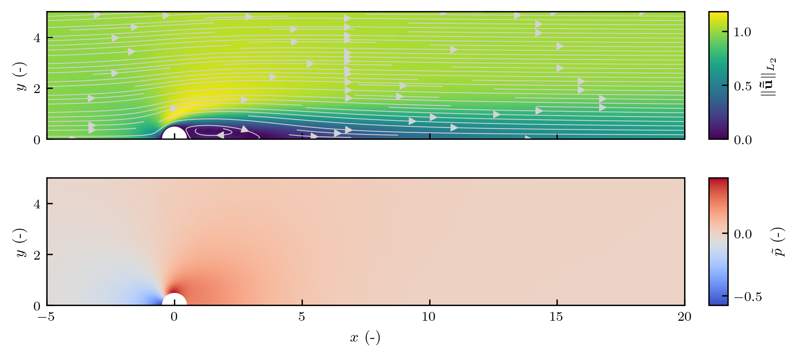
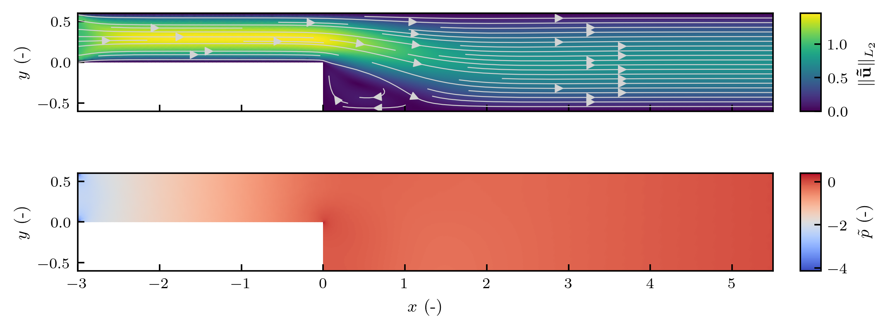

# LSA-FW Solver Baseflow

> [Back to Solver Overview](solver.md)

---

## Introduction

The baseflow solver module, through its main object `BaseFlowSolver`, computes the steady-state (base) flow solution of the incompressible Navier-Stokes equations in non-dimensional form.
This baseflow serves as the background solution around which linear perturbations are introduced in global stability analysis.

The solver performs the following steps:

1. Solves a Stokes problem to obtain a smooth, physically meaningful initial guess.
2. Optionally, ramps the Reynolds number from $\text{Re} = 1$ to the target value in order to improve robustness.
3. Solves the full steady Navier-Stokes equations using the (optionally damped) Newton's method.
4. Provides optional plotting and caching of the resulting baseflow.

## Mathematical Formulation

This utility module solves the steady, incompressible Navier-Stokes equation in non-dimensional form,

$$
\left\lbrace
\begin{align*}
(\mathbf{u} \cdot \nabla ) \mathbf{u} + \nabla p - \frac{1}{\text{Re}} \Delta\mathbf{u} = \mathbf{f} \\
\nabla \cdot \mathbf{u} = 0
\end{align*}\right.,
$$

subject to the specified boundary conditions. 
Here $\text{Re}$ is the Reynolds number, $\mathbf{u}$ is the velocity field, and $p$ is the pressure field.

Dirichlet, Neumann and Robin conditions may be set, as described in the [FEM boundary conditions](fem-bcs.md) document.

The above system is solved for $\mathbf{u}$ and $p$ in the given finite element spaces (e.g., Taylor–Hood, $[P_2]^d - P_1$).

Let $\mathbf{v}$ be a test function in the velocity space and $q$ a test function in the pressure space.
The weak form of the steady Navier–Stokes equations is formulated as 

$$
\text{Find } (\mathbf{u}, p) \text{ such that } \quad \forall (\mathbf{v}, q):
$$

$$
\begin{align*}
\int_\Omega (\mathbf{u} \cdot \nabla \mathbf{u}) \cdot \mathbf{v}dx + \frac{1}{\text{Re}}\int_\Omega \nabla \mathbf{u} : \nabla \mathbf{v}dx +& \int_\Omega p(\nabla \cdot \mathbf{v})dx + \int_\Omega q(\nabla \cdot \mathbf{u})dx + \int_{\Gamma_R} \alpha (\mathbf{u}\cdot \mathbf{v})ds &= \cdots\\
& \cdots= \int_\Omega \mathbf{f} \cdot \mathbf{v} dx + \int_{\Gamma_N} \mathbf{g}\cdot \mathbf{v}ds + \int_{\Gamma_R} \alpha (\mathbf{g}\cdot \mathbf{v})ds.
\end{align*}
$$

### Stokes Initial Guess

Prior to solving the nonlinear problem, the module assembles and solves the Stokes equations:

$$
\left\lbrace
\begin{aligned}
-\Delta \mathbf{u} + \nabla p &= \mathbf{f} \quad \text{in } \Omega, \\
\nabla \cdot \mathbf{u} &= 0 \quad \text{in } \Omega,
\end{aligned}
\right.
$$

subject to the same boundary conditions.
The source term $\mathbf{f}$ is assumed zero by default.
The weak form used in the implementation reads:

$$
\int_\Omega \nabla \mathbf{u} : \nabla \mathbf{v} dx  + \int_\Omega p(\nabla \cdot \mathbf{v})dx  + \int_\Omega q(\nabla \cdot \mathbf{u})dx = \int_\Omega \mathbf{f} \cdot \mathbf{v} dx + \cdots
$$

where the right-hand side includes any Neumann or Robin terms.

> **Note:** The sign of the pressure term is flipped in the implementation to preserve symmetry and reuse block-symmetric solvers across Stokes and Navier–Stokes.

Using the Stokes flow as an initial guess improves robustness, especially at moderate and high Reynolds numbers where Newton's method is highly sensitive to initial conditions.

## Baseflow Examples

### Cylinder Flow



This domain models flow past a circular cylinder in a confined channel, a classic benchmark for vortex shedding and instability.

### Backward-Facing Step



This geometry illustrates flow separation and reattachment, and is commonly used in reattachment length studies.

## API Overview

### `BaseFlowSolver`

```python
BaseFlowSolver(
    spaces: FunctionSpaces,
    *,
    bcs: BoundaryConditions | None = None,
    tags: MeshTags | None = None,
)
```

Main interface for solving the steady Navier–Stokes equations.

#### Method `solve`

```python
solve(
    re: float,
    *,
    ramp: bool = False,
    steps: int = 3,
    max_it: int = 1000,
    tol: float = 1e-6,
    damping_factor: float = 1.0,
    show_plot: bool = False,
    plot_scale: float = 0.01,
    cache: CacheStore | None = None,
    key: str | None = None,
) -> dfem.Function
```

* **`re`** – Target Reynolds number.
* **`ramp`**, **`steps`** – If enabled, solves a sequence of increasing $\text{Re}$ values from 1.0 to `re`.
* **`damping_factor`** – Controls damping in Newton updates.
See [Nonlinear Solver](solver-nonlinear.md).
* **`show_plot`** – Toggle optional visualization
* **`cache`**, **`key`** – If provided, allows loading/saving cached baseflows.

Internally, solves a Stokes problem for initial guess and uses Newton's method via [`NewtonSolver`](solver-nonlinear.md).

### Utility Functions

#### `compute_recirculation_length`

```python
compute_recirculation_length(baseflow: dfem.Function, *, restrict_to_centreline: bool = False, centreline_tol: float = 1e-6) -> float
```

Computes the recirculation length as the maximum $x$-coordinate where $u\_x < 0$.
If `restrict_to_centreline` is enabled, the search is limited to $|y| < \varepsilon$ (useful for cylinder-flow).

Useful for validation and quantitative comparison of baseflow results.

### Import / Export

Baseflow import and export is implemented for serial runs only.

#### `export_baseflow`

```python
export_baseflow(baseflow: dfem.Function, output_folder: Path, *, linear_velocity_ok: bool = False)
```

* Exports velocity and pressure components separately as PETSc binary files.
* If velocity space is $P^2$, can interpolate to $P^1$ to enable safe export.
* Use `linear_velocity_ok=True` only if downstream modules accept lower accuracy.

> **Warning:** Do not use in parallel.
> Mixed function layouts are not portable across ranks.

#### `load_baseflow`

```python
load_baseflow(input_folder: Path, spaces: FunctionSpaces) -> dfem.Function
```

* Loads previously exported baseflow.
* Reconstructs a mixed function in `spaces.mixed`.
* Not guaranteed to preserve full fidelity, especially if export was interpolated.

## Example

```python
from Meshing import Mesher, Geometry
from FEM.spaces import define_spaces, FunctionSpaceType
from FEM.bcs import define_bcs, BoundaryCondition
from Solver.baseflow import BaseFlowSolver

mesher = Mesher.from_geometry(Geometry.CYLINDER_FLOW, cfg)
mesher.mark_boundary_facets(marker_fn)

spaces = define_spaces(mesher.mesh, FunctionSpaceType.TAYLOR_HOOD)
bcs = define_bcs(mesher, spaces, [BoundaryCondition.from_config(c) for c in cfg_bcs])

solver = BaseFlowSolver(spaces, bcs=bcs)
baseflow = solver.solve(
    re=80.0,
    ramp=True,
    steps=5,
    damping_factor=0.8,
    show_plots=True,
)
```

## CLI Integration

The baseflow solver can be called from the command line via:

```bash
python -m Solver baseflow \
    --geometry cylinder_flow \ # example
    --config path/to/config/file \
    --facet-config path/to/facets/config/file \
    --re 80.0 --steps 5 --damping 0.8 --plot # example
```

This builds the mesh, loads boundary conditions, computes the baseflow, and optionally plots it.
