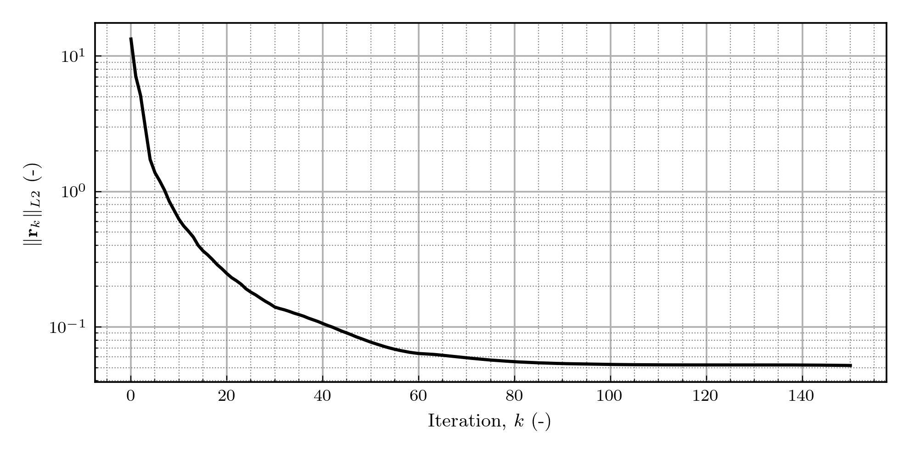

# LSA-FW Linear Solver

> [Back to Solver Index](solver.md)

---

## Introduction

The linear solver module, through its main object `LinearSolver`, provides a unified, extensible interface for solving the linear systems that arise in the finite element discretization of fluid flow problems within LSA-FW.

It supports both direct and iterative methods, with backends based on:

* **PETSc** (`iKSP` wrapper) for parallel and scalable solutions.
* **SciPy** (`splu`) for serial, dense-factorization workflows.

This abstraction layer ensures that all solvers — from baseflow computations to eigenvalue problems — can share a common solving interface while keeping assembly and plotting consistent.

## Theoretical Background

In finite element formulations, the discretization of the PDE system may lead to linear algebraic systems,

$$
\mathbf{A} \mathbf{x} = \mathbf{b},
$$

where

* $\mathbf{A}$ is the system matrix assembled from the variational form,
* $\mathbf{b}$ is the right-hand side vector, and
* $\mathbf{x}$ contains the unknown degrees of freedom (velocity, pressure, etc.).

The solver can use:

1. Direct methods, where $\mathbf{A}$ is factorized (e.g., LU decomposition) and the system is solved in a single step.

    - Pros: Robust, accurate.
    - Cons: Memory intensive, less scalable.

2. Iterative methods, where from am initial guess $\mathbf{x}_0$, the solution is refined until convergence,

$$
\mathbf{x}_{k+1} = \mathbf{x}_k + \Delta\mathbf{x}_k.
$$

   - Pros: Lower memory usage, scalable in parallel.
   - Cons: May require preconditioners, sensitive to conditioning.

Common iterative schemes used:

* CG (Conjugate Gradient) — symmetric positive-definite systems.
* GMRES (Generalized Minimal Residual) — general nonsymmetric systems.

## Mathematical Foundation of GMRES

> GMRES is the **default iterative solver** in LSA-FW because most system matrices arising from incompressible Navier–Stokes discretizations are nonsymmetric and possibly indefinite, making CG unsuitable without special preconditioning.

GMRES solves $\mathbf{A} \mathbf{x} = \mathbf{b}$ by constructing a sequence of Krylov subspaces:

$$
\mathcal{K}_m(\mathbf{A}, \mathbf{r}_0) = \text{span}\{\mathbf{r}_0, \mathbf{A} \mathbf{r}_0, \mathbf{A}^2 \mathbf{r}_0, \dots, \mathbf{A}^{m-1} \mathbf{r}_0\},
$$

where $\mathbf{r}_0 = \mathbf{b} - \mathbf{A} \mathbf{x}_0$ is the initial residual.

At the $m$-th step, GMRES chooses $\mathbf{x}_m \in \mathbf{x}_0 + \mathcal{K}_m$ such that the residual norm

$$
\|\mathbf{b} - \mathbf{A} \mathbf{x}_m\|_2
$$

is minimized over the Krylov subspace.
This minimization is performed via an Arnoldi orthogonalization, which generates an orthonormal basis ${\mathbf{v}_1, \dots, \mathbf{v}_m}$ and a small Hessenberg matrix $\mathbf{H}_m$.

The reduced problem

$$
\min_{\mathbf{y} \in \mathbb{R}^m} \| \beta \mathbf{e}_1 - \mathbf{H}_m \mathbf{y} \|_2
$$

is solved at each iteration, and the approximate solution is updated as

$$
\mathbf{x}_m = \mathbf{x}_0 + \mathbf{V}_m \mathbf{y}_m.
$$

**Key properties:**

* Monotonically non-increasing residual norm.
* Guaranteed convergence in at most $n$ steps for an $n\times n$ system (in exact arithmetic).
* Robust for general nonsymmetric systems.

**Practical considerations in LSA-FW:**

* Restarted GMRES is used to limit memory growth.
* Preconditioning is currently set to `NONE` by default, but hooks exist for adding physics-aware preconditioners.
* Tolerances (`tol`, `rtol`) directly control convergence stopping criteria.

### Residual Convergence Example

The figure below illustrates the residual norm decay when solving the steady Stokes problem for a 2D cylinder wake configuration using GMRES with no preconditioning.



The residual decreases monotonically, reaching the specified tolerance within less than 200 iterations, demonstrating the robustness of GMRES even without preconditioning for this symmetric-like system.

## API Reference

### Class: `LinearSolver`

```python
LinearSolver(assembler: BaseAssembler)
```

---

#### `direct_lu_solve`

```python
direct_lu_solve(
    *,
    show_plot: bool = True,
    plot_scale: float = 0.1,
    use_scipy: bool = True,
    key: int | str | None = None,
) -> dfem.Function
```

---

#### `direct_scipy_solve`

```python
direct_scipy_solve(
    *,
    show_plot: bool = True,
    plot_scale: float = 0.1,
    key: int | str | None = None,
) -> dfem.Function
```

---

#### `cg_solve`

```python
cg_solve(
    *,
    tol: float = 1e-12,
    rtol: float = 1e-8,
    max_it: int = 1000,
    show_plot: bool = True,
    plot_scale: float = 0.1,
    key: int | str | None = None,
) -> dfem.Function
```

---

#### `gmres_solve` *(default)*

```python
gmres_solve(
    *,
    tol: float = 1e-12,
    rtol: float = 1e-8,
    max_it: int = 1000,
    restart: int = 30,
    show_plot: bool = True,
    plot_scale: float = 0.1,
    key: int | str | None = None,
) -> dfem.Function
```

> More solver interfaces (`BiCGSTAB`, etc.) can be added as needed.

## Example Usage

```python
from FEM.operators import StokesAssembler
from Solver.linear import LinearSolver

assembler = StokesAssembler(spaces, bcs=bcs)
solver = LinearSolver(assembler)

# Default solver: GMRES
sol = solver.gmres_solve(tol=1e-10, rtol=1e-8, max_it=500)

# Direct LU (serial)
sol_direct = solver.direct_lu_solve(use_scipy=True)
```


