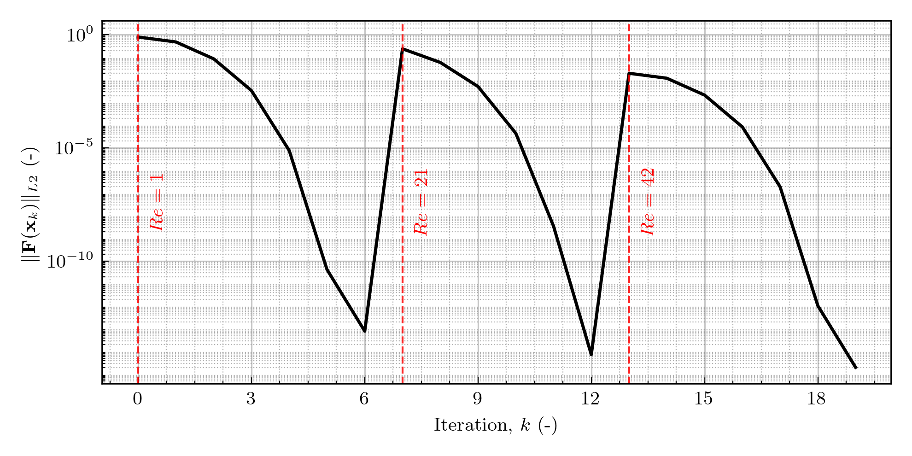

# LSA-FW Nonlinear Solver

> [Back to Solver Index](solver.md)

---

## Introduction

The nonlinear solver module, implemented through the main object `NewtonSolver`, provides a robust and extensible interface for solving nonlinear PDE systems in LSA-FW, such as the stationary Navier–Stokes equations.

It builds upon PETSc's SNES interface, offering:

* Reusable distributed PETSc matrix and vector objects.
* User-supplied residual and Jacobian callbacks.
* Flexible Newton-type solvers with line search and damping.
* MPI-parallelism and scalable performance.
* Iteration monitoring and residual history for diagnostics.

This abstraction ensures that nonlinear problems — e.g., baseflow computations in fluid dynamics — can be solved with high performance and consistency, while integrating seamlessly with LSA-FW's `BaseAssembler` and boundary condition infrastructure.

## Theoretical Background

In nonlinear finite element formulations, the discretized PDE system leads to a set of equations of the form

$$
\mathbf{F}(\mathbf{x}) = \mathbf{0},
$$

where

* $\mathbf{F}(\mathbf{x})$ is the nonlinear residual vector, typically arising from assembling variational forms,
* $\mathbf{x}$ is the vector of unknown degrees of freedom (velocity, pressure, etc.).

### Newton's Method

Newton's method solves $\mathbf{F}(\mathbf{x}) = \mathbf{0}$ iteratively by linearizing about the current approximation,

$$
\mathbf{J}(\mathbf{x}_k) \, \Delta \mathbf{x}_k = -\mathbf{F}(\mathbf{x}_k),
$$

where $\mathbf{J}(\mathbf{x}_k) = \frac{\partial \mathbf{F}}{\partial \mathbf{x}}$ is the Jacobian matrix.

The update rule reads

$$
\mathbf{x}_{k+1} = \mathbf{x}_k + \lambda_k \Delta \mathbf{x}_k,
$$

with $\lambda_k \in (0,1]$ a damping parameter (line-search step length).

One of the main disadvantages of this method is that it may diverge if the initial guess is poor, or if the Jacobian is ill-conditioned.

## Mathematical Foundation of SNES

SNES (Scalable Nonlinear Equations Solvers) in PETSc provides a flexible framework:

1. **Residual function:** $F(\mathbf{x})$ assembled via variational forms.
2. **Jacobian matrix:** $J(\mathbf{x})$ assembled at each iteration.
3. **Linear solver (KSP):** Used internally to solve the Newton step.
4. **Line search:** Ensures global convergence by adaptively choosing $\lambda_k$.
5. **Stopping criteria:** Based on absolute tolerance, relative tolerance, or iteration limits.

**Iteration process:**

1. Assemble residual and Jacobian.
2. Solve linear system $J \Delta x = -F$.
3. Perform line search update $x_{k+1} = x_k + \lambda \Delta x$.
4. Check convergence: $|F(x_{k+1})| < \text{tol}$.

## Practical Considerations in LSA-FW

* **Linear solver inside Newton:** Defaults to GMRES with LU preconditioning (`MUMPS`), ensuring robustness.
* **MPI parallelism:** Residual and Jacobian assembly are distributed across ranks.
* **Damping factor:** User-controllable, defaults to `1.0` (undamped).
* **Residual monitoring:** Iteration history is stored for plotting and diagnostics.
* **Integration with assemblers:** Works with any `BaseAssembler` providing variational forms and boundary conditions.

### Residual Convergence Example

The figure below shows the Newton residual norm across a Reynolds ramp used for robust baseflow convergence.
It is solved sequentially at increasing $Re$ (e.g., $Re=1 \rightarrow 21 \rightarrow 42$), reusing each converged state as the initial guess for the next stage.

The curve concatenates the Newton residuals over all stages.
Red dashed vertical lines mark the transitions between Reynolds numbers, and each transition is annotated with the corresponding $Re$ in red.
Within each $Re$ block, the residual typically exhibits the steep decay expected of Newton's method near the solution; a small jump at each $Re$ change reflects the harder problem that follows, after which the line search drives the residual back down to the target tolerance.



## API Reference

### Class: `NewtonSolver`

```python
NewtonSolver(
    assembler: BaseAssembler,
    *,
    damping: float = 1.0,
)
```

#### `solve`

```python
solve(
    *,
    max_it: int = 500,
    tol: float = 1e-8,
) -> dfem.Function
```

Solve the nonlinear PDE system using Newton's method with PETSc SNES.

**Parameters:**

* `max_it`: Maximum number of Newton iterations (default 500).
* `tol`: Residual tolerance for convergence (default 1e-8).

**Returns:**

* `dfem.Function`: The converged solution function.

## Example Usage

```python
from FEM.operators import StationaryNavierStokesAssembler
from Solver.nonlinear2 import NewtonSolver

assembler = StationaryNavierStokesAssembler(spaces, bcs=bcs)
solver = NewtonSolver(assembler, damping=0.8)

# Solve nonlinear Navier–Stokes
sol = solver.solve(max_it=50, tol=1e-10)
```
