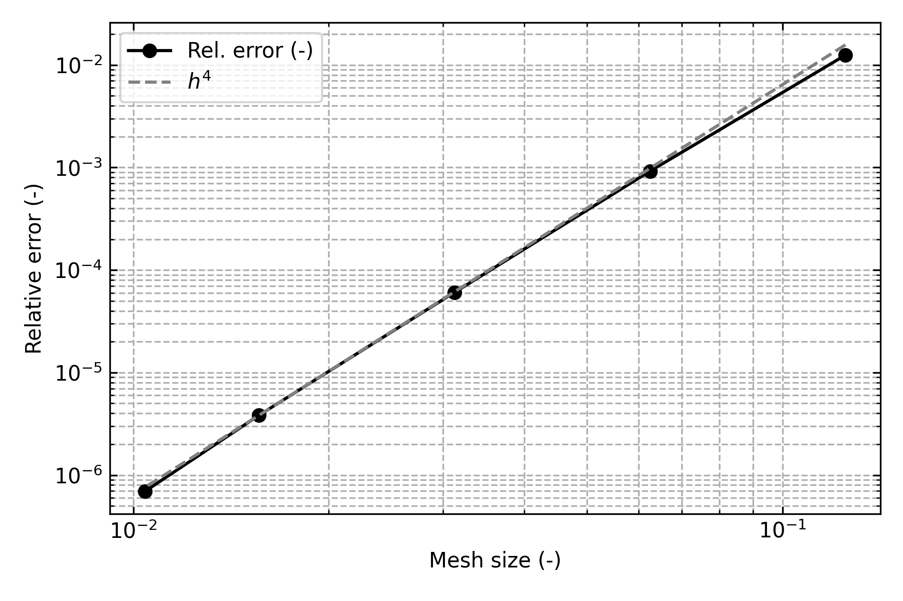

# Vibrating Membrane Benchmark

The vibrating membrane benchmark solves the Dirichlet eigenvalue problem for the Laplacian on a rectangular domain and compares numerical results against the analytical solution.
It serves as a verification tool for the meshing, assembly, and eigenvalue solver components of LSA-FW.
Although the framework is primarily designed for Navier–Stokes problems, only minor adaptations are required for this scalar Helmholtz-type benchmark.

## Problem definition

Let $\Omega = (0,a) \times (0,b)$ be a rectangle.
We consider:

$$
-\Delta u = \lambda u \quad \text{in } \Omega, \qquad u=0 \quad \text{on } \partial\Omega,
$$

with the normalization $\|u\|_{L^2(\Omega)} = 1$.

The weak form reads: find $(\lambda,u)\in\mathbb{R}_{>0}\times V$, $u\neq 0$, such that:

$$
a(u,v) = \lambda\, m(u,v) \quad \forall v \in V, \quad m(u,u) = 1,
$$

where

$$
a(u,v) = \int_{\Omega} \nabla u \cdot \nabla v \, dx, \qquad m(u,v) = \int_{\Omega} u\,v \, dx,
$$

and $V := H_0^1(\Omega)$.

## Analytical solution

Separation of variables directly yields the eigenfunctions:

$$
u_{mn}(x,y) = \sin\!\left( \frac{m\pi x}{a} \right) \sin\!\left( \frac{n\pi y}{b} \right), \quad m,n \in \mathbb{N},\ m,n \ge 1,
$$

with eigenvalues:

$$
\boxed{\ \lambda_{mn} = \pi^2\left( \frac{m^2}{a^2} + \frac{n^2}{b^2} \right) \ }
$$

All eigenfunctions are analytic, so full regularity is available for convergence theory.

### Expected convergence rate

Let $V_h \subset V$ be a conforming FE space of polynomial degree $p$ on a quasi-uniform mesh with size $h$.
The discrete problem is:

$$
a(u_h, v_h) = \lambda_h\, m(u_h, v_h) \quad \forall v_h \in V_h,\quad m(u_h, u_h) = 1.
$$

For $u\in H^{p+1}(\Omega)$ we have the interpolation estimates:

$$
\|u - I_h u\|_{H^1} \lesssim h^p, \quad \|u - I_h u\|_{L^2} \lesssim h^{p+1}.
$$

Babuška–Osborn theory gives:

$$
|\lambda_h - \lambda| \lesssim \|u - u_h\|_{H^1}^2 \lesssim h^{2p}.
$$

Thus:

* $H^1$-error in eigenfunctions: $\mathcal{O}(h^p)$
* $L^2$-error in eigenfunctions: $\mathcal{O}(h^{p+1})$
* Eigenvalue error: $\mathcal{O}(h^{2p})$

For our quadratic elements ($p=2$), the eigenvalue error converges as:

$$
\boxed{\ |\lambda_h - \lambda| = \mathcal{O}(h^4) \ }
$$

This matches the slope observed in the numerical convergence plots.

## Implementation in LSA-FW

The benchmark code:

1. **Mesh generation:** Uses `Mesher` to build a triangular mesh for $[0,a] \times [0,b]$ and mark all boundaries with Dirichlet tags.
2. **Function space:** Creates a scalar $P_2$ Lagrange space..
3. **Boundary conditions:** Applies homogeneous Dirichlet BCs via adapted versions of LSA-FW's `define_velocity_bcs`.
4. **Matrix assembly:** Uses `VariationalForms.mass` and `VariationalForms.stiffness` to assemble the generalized eigenproblem:

   $$
   A u_h = \lambda_h M u_h.
   $$

5. **Eigenvalue solver:** Employs `EigenSolver` with SLEPc in generalized Hermitian mode (`GHEP`), computing the smallest $N$ eigenvalues.
6. **Filtering:** Removes spurious $\lambda \approx 1$ modes introduced by BC treatment.
7. **Validation:** Compares numerical eigenvalues against the analytical $\lambda_{mn}$.

## Numerical results

For $(a,b) = (2.0,4.0)$, $32\times 32$ mesh, $P_2$ elements, and $N=15$:

| mode            | $\lambda_\text{num}$  | $\lambda_\text{ana}$  | rel. error           |
| --------------- | --------------------- | --------------------- | -------------------- |
| 1               | $3.084254\times 10^0$ | $3.084251\times 10^0$ | $9.01\times 10^{-7}$ |
| 2               | $4.934827\times 10^0$ | $4.934802\times 10^0$ | $5.04\times 10^{-6}$ |
| 3               | $8.019193\times 10^0$ | $8.019054\times 10^0$ | $1.73\times 10^{-5}$ |
| …               | …                     | …                     | …                    |
| Avg. rel. error | —                     | —                     | $6.06\times 10^{-5}$ |

The small errors confirm correct assembly and solver behavior.

## Convergence analysis

We repeat the computation for meshes of sizes $(8,8)$, $(16,16)$, $(32,32)$, $(64,64)$, $(96,96)$, computing the average relative error in the first $N$ eigenvalues.

The log–log plot of error vs. $h$ shows a slope $\approx 4$, confirming the theoretical $\mathcal{O}(h^4)$ rate for eigenvalues with $P_2$ elements.

